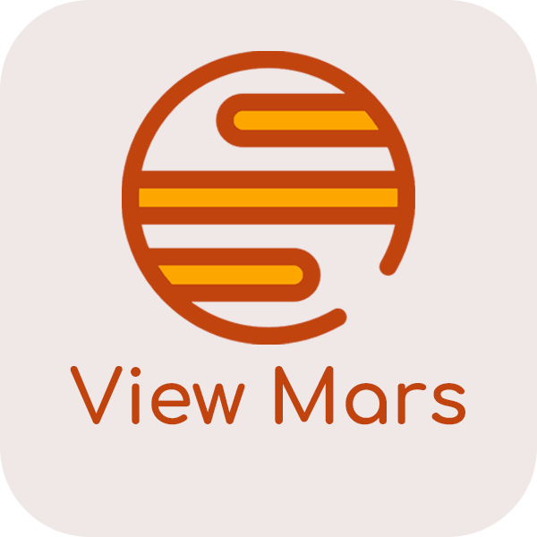

<h1 align="center" style="font-size:28px; line-height:1"><b>View Mars</b></h1>

  

    
  

A tool designed for research and analysis of the planet Mars surface & geology. View Mars web app provides up-to-date downloadable imagery data for many Rovers that were sent to Mars. (PLEASE NOTE: This web app is still being built)

## Website
<h2 align="center" style="font-size:28px; line-height:1">
   https://dyerfire9.github.io/view-mars/
</h2>

## Features
- Modern and Polished interface and design
- Responsive design and layout for different screen sizes
- View updated Rover Data and Photos (updated to the latest day)
- Search by inputing the parameters (Sol, Rover, and Rover Camera)
- Access to thousands of high-quality images from Mars Rovers (Curiosity, Opportunity, Spirit)
- Access to all imagery data from all rover cameras
- Download images individually or all together
- View Map to reference location of image data (40% completed) 
- Help Module
- Technologies: React, JavaScript, HTML, CSS
## Install and Run Application Locally

This project requires Node.js to be installed in order to run

1. Clone the Repo, then install dependencies
2. npm install
3. npm start to start a localhost server with the website.
4. Enjoy Exploring Mars

## Author information
Muhammad Abdul Mannan (corresponding author and repository maintainer)  
Student - University of Toronto  
LinkedIn: www.linkedin.com/in/abdulmannancomp  
Website: https://dyerfire9.github.io/portfolio-site/  
Email: abdulmannancomp@gmail.com  
